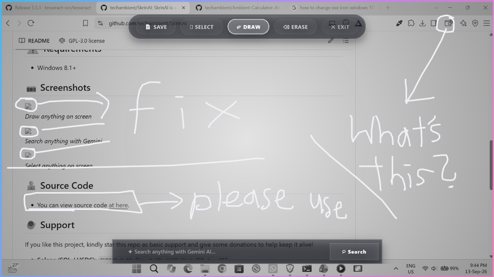
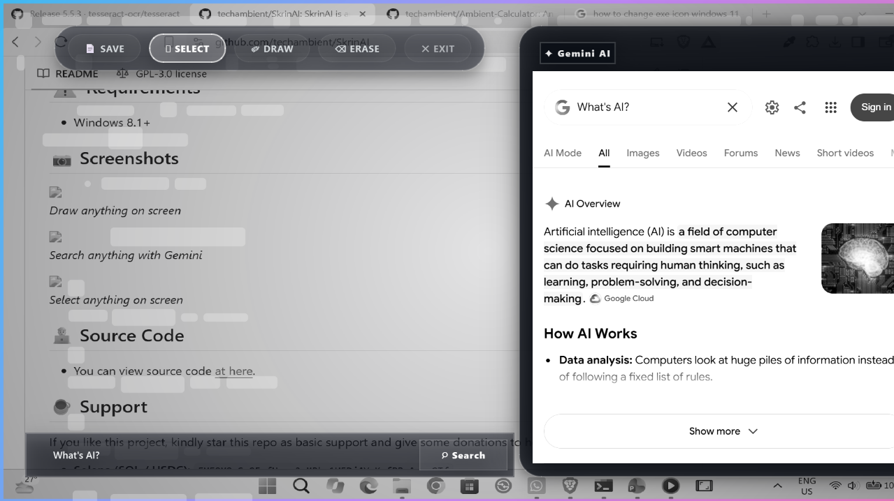
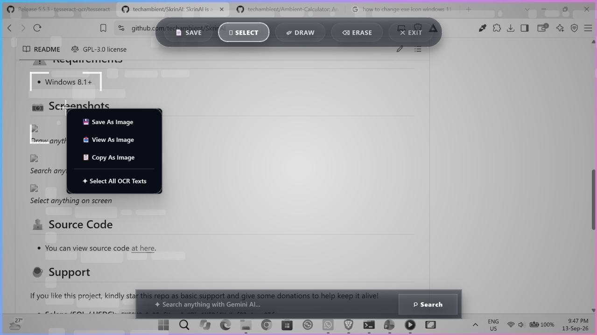

# SkrinAI
Best open source AI-powered ultimate screen tool for Windows.  

## 📖 Features

* None permissions required 
* Select and copy any **text** on screen
* Select and copy any **images** on screen
* Search anything with **Gemini AI**
* **Draw** anything on screen
* Save as **screenshot**
* Fast Speed
* Zero Ads & Zero Tracking

## ⚠️ Requirements

* Windows 8.1+
* [tesseract-ocr](https://github.com/tesseract-ocr/tesseract/releases/tag/5.5.3) installed on machine

## 📷 Screenshots

 <i>Screenshot 1: Draw anything on screen</i> 

 <i>Screenshot 2: Search anything with Gemini</i> 

 <i>Screenshot 3: Select anything on screen</i> 

## 🧑‍💻 Source Code
* You can view source code [at here](https://techambient.github.io/SkrinAI/source). 

## ☕ Support

If you like this project, kindly star this repo as basic support and give some donations to help keep it alive!

* **Solana (SOL / USDC):** `EME9M9cSy9FvfHvcx2gMPkp1H5Dj4YaKufPRsAyon8Tf`
* **Bitcoin (Taproot):** `bc1pguvpjudf9gr2lyjcf4s9ttvzushgu0hqhr2p7fwqzsz4977kajcqemvned`
* **Bitcoin (Native Segwit):** `bc1qwfjwytw8lehg20es373cx2ulr3el99rt9uurz5`

## 💬 Join My Discord Server

Join my discord server at <a href="https://discord.gg/ATnXUUnS">
  Click Here To Join my Discord server
</a>! 

## 🔨 Contributing

Pull requests are strongly recommended. For major changes, please open an issue first to discuss what you would like to change.

## 🌎 Translations

You can help translate SkrinAI by using this repo codes. 

## 📜 License

This project is licensed under [GPL-v3](/LICENSE)
